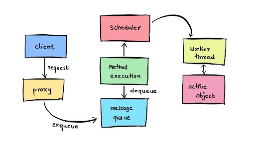

+++
date  = "2023-08-09"
title = 'Active Object Design Pattern in C++'

author = "Wasim Akram"
authorImage ="/teams/wasim.jpg"
preferred = "https://www.linkedin.com/in/wasim-akram-6a86a09b/"
linkedin = "https://www.linkedin.com/in/wasim-akram-6a86a09b/"
twitter = ""
blog = ""
email = "wasim@inpyjama.com"

tags = [
    "c++ 20", "design pattern"
]

categories = [
    "c++",
]

series = ["C++"]
images = ["/post/active-object-pattern/0.webp"]
+++

The Active Object Design Pattern is a concurrency pattern used to separate method invocation from method execution, allowing asynchronous and non-blocking behavior.
<!--more-->



## Introduction

The Active Object Design Pattern is a concurrency pattern used to separate method invocation from method execution, allowing asynchronous and non-blocking behavior. It is particularly useful in C++ for handling concurrent tasks efficiently without blocking the main execution thread. In this article, we'll explore the Active Object Design Pattern and demonstrate its real-time application with a practical example in C++.

## Understanding the Active Object Design Pattern

The Active Object Design Pattern decouples method invocation from execution by using a message queue to buffer method calls. The active object, which contains the methods to be executed, processes the message queue in a separate thread. This design ensures that the main thread is not blocked, and multiple tasks can be executed concurrently.

## Example

```cpp {title="Asynchronous Printing Active Object."}
#include <iostream>
#include <thread>
#include <queue>
#include <mutex>
#include <condition_variable>

// Active Object Class
class ActivePrinter {
public:
    ActivePrinter() : is_running(true) {
        worker_thread = std::thread(&ActivePrinter::processMessages, this);
    }

    ~ActivePrinter() {
        is_running = false;
        condition.notify_one();
        worker_thread.join();
    }

    // Asynchronous Print Method
    void asyncPrint(const std::string& message) {
        std::unique_lock<std::mutex> lock(mutex);
        messages.push(message);
        condition.notify_one();
    }

private:
    std::queue<std::string> messages;
    std::thread worker_thread;
    std::mutex mutex;
    std::condition_variable condition;
    bool is_running;

    // Method to process messages from the queue
    void processMessages() {
        while (is_running) {
            std::unique_lock<std::mutex> lock(mutex);
            condition.wait(lock, [this]() { return !messages.empty() || !is_running; });

            if (!messages.empty()) {
                std::string message = messages.front();
                messages.pop();
                lock.unlock();

                // Simulate time-consuming task (e.g., printing)
                std::this_thread::sleep_for(std::chrono::seconds(1));

                std::cout << "Printing: " << message << std::endl;
            }
        }
    }
};

int main() {
    ActivePrinter printer;

    // Asynchronous print calls
    printer.asyncPrint("Document 1");
    printer.asyncPrint("Document 2");
    printer.asyncPrint("Document 3");

    // Other tasks can run concurrently with printing...

    // Wait for printing to complete
    std::this_thread::sleep_for(std::chrono::seconds(3));

    return 0;
}
```

```bash {title="output"}
Printing: Document 1
Printing: Document 2
Printing: Document 3
```

## Explanation

In this example, we create an Active Printer class, which acts as the active object for asynchronous printing. The class contains a message queue to buffer print requests. The `asyncPrint` method is used to enqueue print requests into the message queue.

A separate worker thread (`processMessages`) processes the message queue. It waits for messages to be available in the queue and then executes the print operation asynchronously. After printing, it dequeues the message from the queue.

The main function demonstrates asynchronous printing of three documents using the `asyncPrint` method. Other tasks can run concurrently while printing happens in the background, ensuring non-blocking execution.

## Advantages of the Active Object Design Pattern
1. **Concurrency**: The Active Object Pattern allows efficient execution of multiple tasks concurrently, enhancing application responsiveness.
1. **Non-Blocking**: The main thread remains non-blocking, enabling smooth execution of tasks while waiting for time-consuming operations to complete.
1. **Encapsulation**: Method invocation and execution are decoupled, promoting better code organization and encapsulation of functionality.
1. **Modularity**: The active object can be reused in different contexts, promoting code modularity and reusability.

## Conclusion

The Active Object Design Pattern is a valuable tool in C++ for managing concurrent tasks efficiently and non-blocking manner. By using a message queue and separate worker thread, the active object ensures asynchronous execution of methods while freeing the main thread to perform other tasks. In this article, we demonstrated a real-time example of an active object performing asynchronous printing. Embrace the Active Object Design Pattern to improve the concurrency and responsiveness of your C++ applications. Happy coding!

