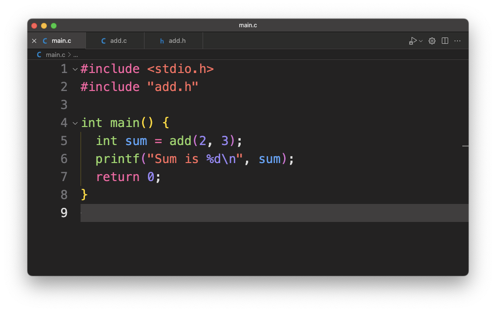
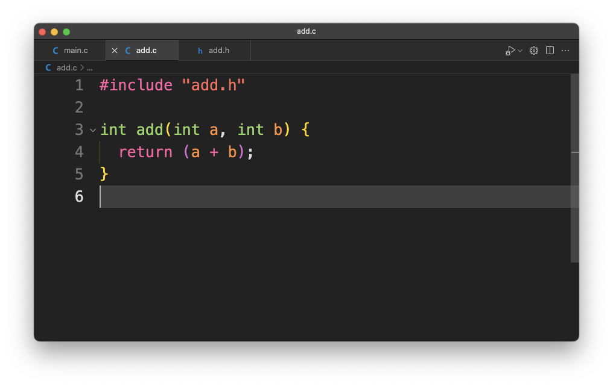
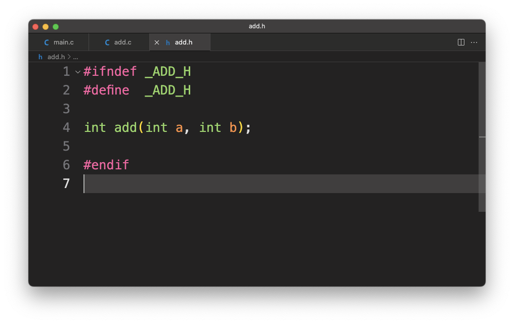

+++
date  = "2023-07-17"
title = 'Build System: A developers Chauffeur'

author = "Rajat Batra"
authorImage ="/teams/rajat.jpg"
preferred = "https://www.linkedin.com/in/rajat-batra-a88124126/"
linkedin = "https://www.linkedin.com/in/rajat-batra-a88124126/"
twitter = ""
blog = ""
email = "rajat@inpyjama.com"

tags = [
    "makefile", "camke"
]

categories = [
    "build system",
]

series = ["build system"]
images = ["/post/makefile-1/1.webp"]
+++

Behind the scenes of the coding universe lies the secret superhero known as the compiler. With lightning speed and super heroic intelligence, it takes your human-readable code and transforms it into a symphony of ones and zeros that machines can understand.

<!--more-->

> Working without a build system is like trying to assemble a jigsaw puzzle with a blindfold on and oven mitts for hands. It's a recipe for chaos and burnt fingers! -ChatGPT

## The Boring task of compilation

To build a source file the developer invokes the compiler to compile that file into a format machine can understand. This looks handy for a single or couple of source files, but what if there are 10s or 100s of source files, compiling each of them by manually invoking a compiler does not look handy anymore.

However, this process can be automated by writing a tool that can search the list of sources and invoke the compiler on them one by one. Let's assume we have a tool that takes n number of source files and compiles them one by one to create a final binary.

Consider a scenario where you have a C program consisting of two files: main.c and add.c. The main.c file contains the main() function, and the add.c file contains the custom implementation of some add() function used in the program.

Here's an example of the `main.c` file

And here's an example of the `add.c` and `add.h` files:

In this example, the `main.c` file depends on the add.h header file, which declares the add function. The `#include "add.h"` directive is used to include the header file in the `main.c` file, allowing the compiler to recognize the function declaration.

Now let's compile it by giving it to our imaginary tool and it compiles both `add.c` and `main.c` and generates a binary. Great! Everything works as planned.

Let's re-compile our application using our tool. It compiles both `main.c` and `add.c` again as expected and generates an application.

Do you see a problem here?

> We did not modify anything, but our tool still compiled both `main.c` and `add.c` again. There is no functional issue here, the tool is working as expected, but it spent computing resources on compiling something that could have been avoided.

The output application is dependent on `main.c` and `add.c` and should be regenerated only if at least one of them is modified.

We need to add functionality to our imaginary tool so that it can identify if any of the dependencies have changed and whether it needs to rebuild them or skip them. This will save us time and computing resources.

> The imaginary tool that we have been cooking up is called a build system.

## The build System

A build system is a collection of tools that assist in transforming the source code into a final executable. It involves tasks such as dependency management, compilation, and packaging. By automating these tasks, a build system ensures consistency and enhances productivity throughout the development lifecycle.

The core components of a build system typically include:

1. **Dependency Management**: Build systems handle the resolution and management of dependencies. They ensure that all required libraries, frameworks, and modules are available during the build process. This involves fetching the necessary dependencies from repositories, managing versions and conflicts, and integrating them into the build.
1. **Compilation and Linking**: Build systems invoke the appropriate compilers or interpreters to translate the source code into executable or intermediate object code. They handle compiling individual source files, managing `#include` paths, and linking together the compiled code with external libraries to create the final executable or library.
1. **Packaging and Distribution**: Once the build is successful, the build system can package the software into a deployable format, such as a signed binary that can be flashed onto the board using a JTAG.
1. **Incremental Builds and Caching**: Several build systems are available for Embedded development, incremental builds, and caching. Incremental builds only recompile the modified parts of the source code, reducing unnecessary recompilation and saving time. Caching mechanisms store previously built artifacts, allowing them to be reused when dependencies and build configurations remain unchanged.

Several build systems are available for Embedded development, but the most used one is `make`.

`make`, a classic build automation tool has been around for decades and remains popular today. It uses `Makefile`, which specifies dependencies and commands, to manage the build process. Make intelligently determines which files need to be recompiled based on their timestamps, making it efficient for incremental builds. However, makefiles can become complex and difficult to maintain as the project grows.

We will investigate the specifics of `make` in future blog posts and understand how it can be used to build and manage the development life cycle.

May The `MAKE` be with you!!!!!
