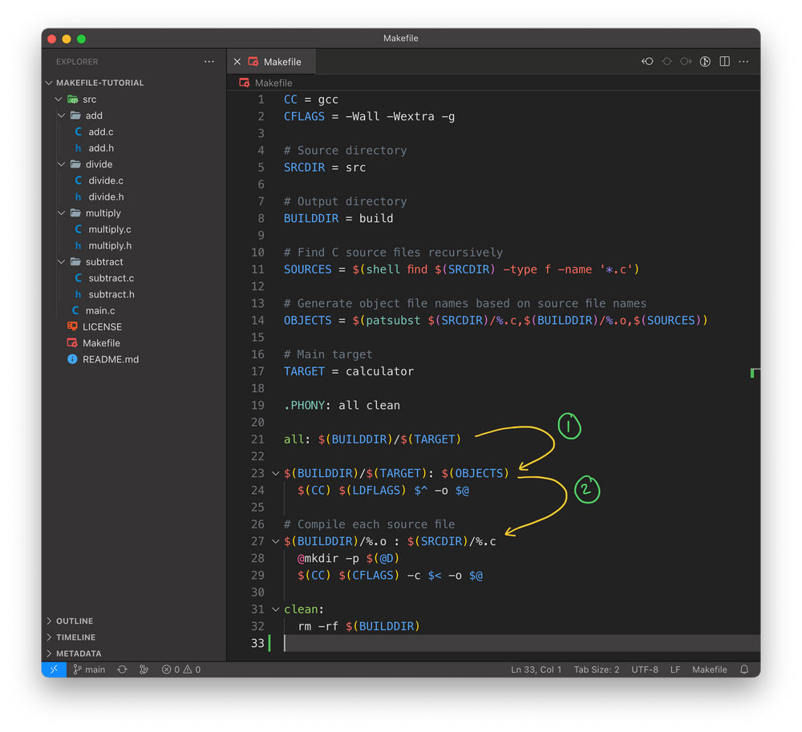

+++
date  = "2023-07-18"
title = 'Makefile: The Secret Sauce'

author = "Rajat Batra"
authorImage ="/teams/rajat.jpg"
preferred = "https://www.linkedin.com/in/rajat-batra-a88124126/"
linkedin = "https://www.linkedin.com/in/rajat-batra-a88124126/"
twitter = ""
blog = ""
email = "rajat@inpyjama.com"

tags = [
    "makefile", "camke"
]

categories = [
    "build system",
]

series = ["build system"]
images = ["/post/makefile-2/0.webp"]
+++

In the previous blog post on build systems, we learned what a build system is and its significance in the software life cycle. We ended that post by introducing the `make` build system. Today we will dive deeper into the `make` build system and learn how it can be used to simplify the build process.
<!--more-->

In the realm of embedded software development, where projects grow in complexity, the need for efficient and automated build systems becomes utmost. Enter `make` - a tool that simplifies the compilation, dependency management, and execution of your code. In this blog post, we will explore the syntax and structure of `Makefile`.

## What's a Makefile? 🤔

`Makefile` is a script executed by the make tool that lets the developer define the flow of the build process. It works by defining dependencies between the source files and specifying the commands required to compile and link them. So, now the developer can compile the codebase using a single command, instead of manually compiling each source file separately.

For this tutorial, we will use a simple calculator application as an example. You can access the source code for this tutorial from the [inpyjama](https://github.com/inpjama/Makefile-Tutorial) GitHub page.

## Repository Structure

The repository structure consists of the following files and directories:

- **LICENSE**: This file contains the license under which the code in the repository is released. It specifies the permissions, restrictions, and obligations associated with using the code.
- **Makefile**: The Makefile is used for building and managing the project. It includes instructions on how to compile the source code, handle dependencies, and generate the final executable or other artifacts.
- **README.md**: This is the main `README` file for the repository.
- **src**: This directory contains the source code files of the project. It may include subdirectories for organizing the codebase further. The source code includes the `main.c` and multiple subdirectories that implement functionalities for the calculator.

Let's have a look at the Makefile and try to understand its structure and build flow.

## Defining Local variables

In a `Makefile`, variables are used to store values that can be referenced and reused throughout the file. They help in maintaining consistency, improving readability, and making the `Makefile` more flexible.

Variables in a `Makefile` is declared using the following syntax

```make
VARIABLE_NAME = value
```

and can later be reused using the syntax

```make
$(VARIABLE_NAME)
```

### Typical variables -

```make {title="Makefile"}
CC = gcc
CFLAGS = -Wall -Wextra -g

# Source directory
SRCDIR = src

# Output directory
BUILDDIR = build

# Find C source files recursively
SOURCES = $(shell find $(SRCDIR) -type f -name '*.c')

# Generate object file names based on source file names
OBJECTS = $(patsubst $(SRCDIR)/%.c,$(BUILDDIR)/%.o,$(SOURCES))

# Main target
TARGET = calculator
```

- The `CC` and `CFLAGS` are local variables in the `Makefile` that store the compiler command and compiler flags.
- The `SRCDIR` and `BUILDDIR` contains the src and build directory paths
- The `SOURCES` and `OBJECTS` contains the list of the source files and object files.
- The `TARGET` variable contains the final executable name.

## Using External commands

In a `Makefile`, you can invoke system commands or shell commands using various methods. The most common one is to use the `$(shell)` function. We can use the find shell utility to recursively search for all the `c` source files under the `SRCDIR`.

```make
# Find C source files recursively
SOURCES = $(shell find $(SRCDIR) -type f -name '*.c')
```

The `SOURCES` variable will now contain the following list of files

```bash
src/add/add.c
src/divide/divide.c
src/main.c
src/multiply/multiply.c
src/subtract/subtract.c
```

The `$(OBJECT)` variable contains a list of object files that need to be created under the build directory for every source file under `SOURCES`.

We do this by matching everything between `src/` and `.c` in `SOURCES` and placing it between `build/` and `.o` using the `patsubst` function. Therefore, if we try to print `$(OBJECTS)` variable it will look something like:

```bash
build/add/add.o
build/divide/divide.o
build/main.o
build/multiply/multiply.o
build/subtract/subtract.o
```
The `%` operator is used for pattern matching and substitution in `Makefile`s. It is particularly useful for defining implicit rules, where a generic pattern is matched with multiple files.

> In a future blog post, we will look into different functions provided by Makefiles.

## Defining the Target

In a `Makefile`, targets define specific actions that need to be accomplished. Each target represents a set of rules that are executed when the corresponding target is invoked. Targets are used for defining the build process and specifying the dependencies between different targets of a project.

Targets in a `Makefile` can be specified with the following format:
```make
target: dependencies
    rules
```

### target

The target specifies the name of the rule or action to be executed. It can represent anything ranging from creating an executable to compiling an object file from a source file.
Users can invoke a specific target by specifying its name to the make utility.

```bash
make <target name>
```

### dependencies

The dependencies are the targets that the current target relies on. If any of the dependencies have changed, the associated recipe will be executed. Target rules will only be executed once all dependencies have been completed.

### rules

The rules define the set of commands that need to be executed to accomplish the target. It can include shell commands, compiler invocations, file operations, or any other necessary actions.

## Targets

Let's have a look at the targets defined in our `Makefile`:



### all

If a user invokes, `make` with no target name then the `make` utility tries to execute a default target. Typically, `all` is the default target that make will invoke. Looking at our Makefile the `all` target is dependent on `$(BUILDDIR)/$(TARGET)` therefore it will try to execute `$(BUILDDIR)/$(TARGET)` target as part of the build process.

### `$(BUILDDIR)/$(TARGET): $(OBJECTS)`

The `$(BUILDDIR)/$(TARGET)` or as it expands to `build/calculator` depends on the list of build targets included in the `$OBJECTS`. It will therefore execute each of those targets before executing its rule. After executing all the targets in the `$OBJECTS` it will execute its rule.

```make
$(CC) $^ -o $@
```

Hold on, this looks a bit alien!!

We know that `$(CC)` is used to expand the local `CC` variable that expands to `gcc` but what is `$^` and `$@`.

Well, actually make utility creates some extra variables automatically while parsing targets in a Makefile. Some of these variables are:
1. `@` : This variable contains the target name.
1. `^` : This variable contains the list of all the dependencies listed for the target.
1. `<` : This variable contains the name of the first dependency.

Okay so let's try to understand the rule again based on the wisdom we have gained just now. So, the rule after processing will look like:

```bash
gcc  build/add/add.o build/divide/divide.o build/main.o build/multiply/multiply.o build/subtract/subtract.o -o build/calculator
```

This looks a bit familiar. The rule is trying to link all the object files together to create the calculator application.

### `$(BUILDDIR)/%.o : $(SRCDIR)/%.c`

This is the last target that gets called in the recursive chain. We have already seen this syntax when creating the `$(OBJECTS)` variable. So, it is going to match a `*.o` target and try to have its corresponding `*.c` file as dependency.

Let's take an example, for `build/add/add.o` the target will look like

```make
build/add/add.o : src/add/add.c
    $(CC) $(CFLAGS) -c src/add/add.c -o build/add/add.o
```

This again looks familiar. The target is trying to compile a single `c` source file to an object file.

Based on our understanding if we try to merge all the steps `make` utility will run the following commands as part of build process:

```bash
gcc -Wall -Wextra -g -c src/add/add.c -o build/add/add.o
gcc -Wall -Wextra -g -c src/divide/divide.c -o build/divide/divide.o
gcc -Wall -Wextra -g -c src/main.c -o build/main.o
gcc -Wall -Wextra -g -c src/multiply/multiply.c -o build/multiply/multiply.o
gcc -Wall -Wextra -g -c src/subtract/subtract.c -o build/subtract/subtract.o
gcc  build/add/add.o build/divide/divide.o build/main.o build/multiply/multiply.o build/subtract/subtract.o -o build/calculator
```

This is exactly the sequence a developer would have used to compile the calculator application but now he can do it with a simple `make`, isn't it amazing?

Since the `Makefile` uses the find utility to figure out paths to the source files under `src` directory, developer can add any new source file under `src` directory and make will pick it up as part of build process.

### clean
The clean target contains a command to clean the artifacts generated by make. In our case the artifacts are generated under the build folder therefore, we can clean it by just deleting the build directory.

> Make sure that the indentation in the Makefile is done using tabs, not spaces, as tabs are required by Makefile syntax.

## Conclusion

In this post, we have explored the fundamental concepts of `Makefile`s and learned how to create a basic Makefile for building projects. `Makefile`s are powerful tools for automating the compilation process and managing dependencies, allowing developers to streamline their workflows and improve productivity. We covered important aspects such as defining variables, specifying targets and dependencies, writing rules, and utilizing built-in rules and functions. We also discussed the significance of the `$` and `%` wildcard for pattern matching.

However, like many tools, `Make` has its limitations. In a future post, we will delve deeper into these limitations and explore the more advanced build automation tools that address these challenges.
