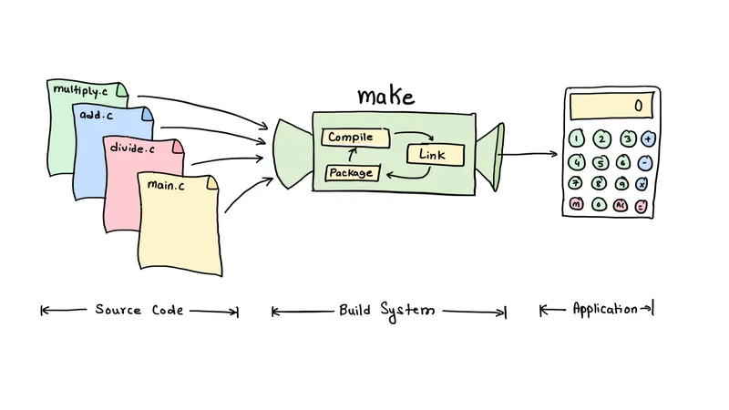

+++
date  = "2023-07-22"
title = "Why I Don't Write Makefiles Anymore!"

author = "Rajat Batra"
authorImage ="/teams/rajat.jpg"
preferred = "https://www.linkedin.com/in/rajat-batra-a88124126/"
linkedin = "https://www.linkedin.com/in/rajat-batra-a88124126/"
twitter = ""
blog = ""
email = "rajat@inpyjama.com"

tags = [
    "makefile", "camke"
]

categories = [
    "build system",
]

series = ["build system"]
images = ["/post/makefile-3/0.webp"]
+++

In this blog post, we scratch the surface of CMake's potential, providing you with an introduction to this powerful build system generator.
<!--more-->



> `Makefiles`, the cryptic enigmas of the coding world - their syntax, an unruly beast that challenges even the bravest developers! But fear not, for with CMake's elegance, we banish the ugliness and unlock the gates to a world of clean, readable build scripts, making development a delightful breeze. -ChatGPT

Don't get me wrong, Make remains a powerful and well-suited build system, particularly for single-language projects. However, why go through the trouble of writing `Makefile` manually when you can simply generate them?

Welcome back, fellow Embedded Wizards!! 🧙

In our earlier blog post about `Makefile`s, we delved into the fundamental syntax and structure of a Makefile and how it deals with dependency management. Now, we shift our attention to examining the limitations of the `make` build system and explore how we can improve it by integrating `cmake`. To demonstrate, let's revisit the [calculator](https://github.com/inpjama/Makefile-Tutorial) example and highlight how `CMake` can enhance the efficiency of the build process.

## The Pain is Real 😥


### The Cryptic Syntax


I like to compare `Makefile`s as the assembly language of build systems because just like assembly language serves as an intermediary between high-level programming languages and machine code, `Makefile`s bridge the gap between human-readable build configuration and the actual commands needed to construct a software project. Much like how assembly language allows low-level control over a computer's hardware, `Makefile`s offer developers fine-grained control over the build process.

However, just as assembly language can be more challenging to read and understand than higher-level programming languages, `Makefile`s may appear cryptic and daunting to those not familiar with their syntax. Recall the cryptic syntax employed in the [calculator](https://github.com/inpjama/Makefile-Tutorial) project.

```make
$(BUILDDIR)/%.o : $(SRCDIR)/%.c
	@mkdir -p $(@D)
	$(CC) $(CFLAGS) -c $< -o $@
```

We understand this syntax now, but just imagine encountering it for the first time!

### The Love for Tabs


As powerful as `Makefile`s are for automating builds, their error messages can often feel like a riddle. When a build fails, decoding these dark messages can be a scary task, even for experienced developers. Let's look at an example target -

```make
all:
    echo "Hello, World!"
```

Try running the above Makefile and you should see the following error message:

```bash
Makefile:2: *** missing separator.  Stop.
```

Everything looks okay, right? The syntax looks correct. What might have gone wrong? 🥵

Different text editors and IDEs handle tabs and spaces differently, leading to inconsistencies in indentation. Hence, most coding guidelines restrict developers from using tabs for indentation. Therefore, most developers configure their IDE to convert TAB to spaces. Without visual highlighting of tabs and spaces in your IDE, the code appears almost indistinguishable to the human eye.

`Makefile`s are notorious for their obsession with tabs. Every command inside a target must be indented with a tab, and this is where chaos lurks. One innocent slip of a space instead of a tab can lead to hours of head-scratching and puzzling errors.

It's a common scenario: you come across something you want to add to your `Makefile`, find it on the web, paste it in, and suddenly, the entire `make` command comes to a screeching halt.

Your code looks perfect, but it refuses to build, leaving you puzzled. You search high and low, trying to find the missing piece, a needle in a haystack of code.

I cannot quantify the countless hours I've spent trying to decipher why my project won't build, only to realize that spaces slipped in where tabs should have been.

> 😓 The Pain is real!

The Dependency Management
Let's recall what we learned in the previous post (Makefile: The Secret Sauce). In a Makefile, targets define specific actions that need to be accomplished. Each target represents a set of rules that are executed when the corresponding target is invoked. Targets are used for defining the build process and specifying the dependencies between different targets of a project.

Targets in a `Makefile` can be specified with the following format:

```make
target: dependencies
    rules
```

Let's compile the [calculator](https://github.com/inpjama/Makefile-Tutorial) application again by running make . It compiles as expected, make is able to resolve the dependency graph, and compiles all the files needed for the [calculator](https://github.com/inpjama/Makefile-Tutorial) application.

```bash
gcc -Wall -Wextra -g -c src/add/add.c -o build/add/add.o
gcc -Wall -Wextra -g -c src/divide/divide.c -o build/divide/divide.o
gcc -Wall -Wextra -g -c src/main.c -o build/main.o
gcc -Wall -Wextra -g -c src/multiply/multiply.c -o build/multiply/multiply.o
gcc -Wall -Wextra -g -c src/subtract/subtract.c -o build/subtract/subtract.o
gcc build/add/add.o build/divide/divide.o build/main.o build/multiply/multiply.o build/subtract/subtract.o -o build/calculator
```

Let's recompile the program by triggering `make` again. Since no changes were made to any of the source files, make did not perform any actions, as the target was considered up-to-date.

The reason behind this behavior is that when we initially run `make`, it records the timestamps of the target and its dependencies. Subsequent executions of `make` involve comparing the stored timestamps with the current timestamps of the target and dependencies. If the target is outdated (i.e., its modification time is earlier than that of any of its dependencies), `make` executes the recipe associated with that target to rebuild it.

This process of comparing timestamps and deciding whether to rebuild targets based on dependency changes is what allows `make` to be so efficient. By only rebuilding the necessary parts of the project, it saves the developer's time and computational resources. Let's run our application and try to add `5` and `1`.

```bash
using add library version 1.0
Enter first number(int): 5
Enter operator (+, -, *, /): +
Enter second number(int): 1
Result: 6
```

The application works as expected. Let's try to modify `add.h` and update the library version to `1.1`.

```bash
#ifndef _ADD_H
#define _ADD_H

#define ADD_VERSION "1.1"
int add(int a, int b);

#endif
```

Let's recompile the code.

```bash
make: Nothing to be done for 'all'.
```

Wait, what just happened? We made changes to the `add.h` file, yet when we ran `make`, it didn't trigger the compilation of `add.c` and `main.c`, both of which include `add.h`.

The reason is that we didn't specify add.h as a dependency for `add.c` or `main.c` in the `Makefile`. Although one might expect `make` to automatically figure out the dependencies by parsing the source files, it only tracks dependencies that are explicitly declared by the user in the Makefile.

There are ways to automate this process using some clever techniques. For instance, if you are using `GCC`, it can generate a list of headers as dependencies, which can then be utilized by the `Makefile` be great to track headers. For more in-depth information on this approach, you can refer to the following Stack Overflow post [Makefile, header dependencies](https://stackoverflow.com/questions/2394609/makefile-header-dependencies).

Indeed, it would be beneficial if developers don't have to handle these details. The act of including headers in the source files already establishes a dependency graph between them. It would be great if `make` can automatically recognize and utilize this existing information to manage dependencies without requiring explicit declarations in the `Makefile`. This way, the build process could be made even more seamless and developer-friendly.

Many build systems available today can handle this task effectively. Let's explore one of the popular ones, `CMake`.

## CMake

`CMake` is not primarily a build system itself instead, it's a tool capable of generating scripts or configuration files for other build systems. `CMake` allows developers to write platform-independent build scripts using `CMakeLists.txt` files that describe the project's build process, including dependencies, compilation options, and linking. These `CMakeLists.txt` files can then be used to generate platform-specific `Makefiles` or build scripts for other build system like `ninja`, making it easier to compile source code across different platforms.

Let's revisit the [calculator](https://github.com/inpjama/Makefile-Tutorial) example and explore how we can utilize CMake to build it. The provided `CMakeLists.txt` file is as follows:

```cmake
cmake_minimum_required(VERSION 3.10)
project(calculator)

set(CMAKE_C_FLAGS "${CMAKE_C_FLAGS} -Wall -Wextra -g")

# Source directory
set(SRCDIR src)

# Find C source files recursively
file(GLOB_RECURSE SOURCES ${SRCDIR}/*.c)

# Main target
set(TARGET calculator)

add_executable(${TARGET} ${SOURCES})
```

This already appears much cleaner and more organized compared to the `Makefile`. Let's have a look at the individual constructs and understand what's going on.

This `CMakeLists.txt` file is used to configure and generate a build system for a simple [calculator](https://github.com/inpjama/Makefile-Tutorial) project. Let's break down the contents of the file:

1. `cmake_minimum_required(VERSION 3.10)`: This line sets the minimum required version of `CMake` needed to configure and generate the build system. This is optional but recommended.
1. `project(calculator)`: This line sets the project name to "calculator". The project name is a required parameter in `CMake` and is used to identify the project.
1. `set(CMAKE_C_FLAGS "${CMAKE_C_FLAGS} -Wall -Wextra -g")`: The `CMAKE_C_FLAGS` is a variable that is defined by `CMake` that contains the compiler flags that will be passed to the compiler. This line appends the options to the existing `CMAKE_C_FLAGS`.
1. `set(SRCDIR src)`: This line sets the variable SRCDIR to the "src" directory.
1. `file(GLOB_RECURSE SOURCES ${SRCDIR}/*.c)`: This line uses the file command to find all `C` source files `(*.c)` in the "src" directory and its subdirectories. It stores the list of found source files in the `SOURCES` variable.
1. `set(TARGET calculator)`: This line sets the variable `TARGET` which will be used as the name of the final executable.
1. `add_executable(${TARGET} ${SOURCES})`: This line creates the main executable target using the `add_executable` command. It takes two 1. 1. `arguments`: the target name and a list of source files. This command instructs CMake to compile the specified source files and link them to create the "calculator" executable.

Now, Let's run `Cmake` and see the magic. `CMake` requires developers to provide at least two arguments: the path to the source directory containing the `CMakeLists.txt` number file and a build directory where the generated artifacts will be stored.

```bash
cmake -S ./ -B ./build_cmake
```

Let's have a look at the generated output.
```bash
-- The C compiler identification is GNU 11.3.0
-- The CXX compiler identification is GNU 11.3.0
-- Detecting C compiler ABI info
-- Detecting C compiler ABI info - done
-- Check for working C compiler: /usr/bin/cc - skipped
-- Detecting C compile features
-- Detecting C compile features - done
-- Detecting CXX compiler ABI info
-- Detecting CXX compiler ABI info - done
-- Check for working CXX compiler: /usr/bin/c++ - skipped
-- Detecting CXX compile features
-- Detecting CXX compile features - done
-- Configuring done
-- Generating done
-- Build files have been written to: <xyz path>build_cmake
```

Even though we didn't explicitly specify the compiler to CMake, it was able to automatically detect the installed compiler and will use it to compile our code. Omg!!! just have a look at the number of files generated by Cmake under the `build_cmake` directory😨.

We will explore the advanced features of `CMake` in a future post, we will take a closer look at some of the generated files at that time. However, for now, our primary focus should be on the "build_cmake/Makefile". As mentioned earlier, `CMake` is not a build system itself, rather, it acts as a tool that generates build scripts for other build systems. In this case, `CMake` generated a `Makefile` for the make build system. Let's run this generated `Makefile` and build our project.

```bash
cd build_cmake
make
```
```bash
[ 16%] Building C object CMakeFiles/calculator.dir/src/add/add.c.o
[ 33%] Building C object CMakeFiles/calculator.dir/src/divide/divide.c.o
[ 50%] Building C object CMakeFiles/calculator.dir/src/main.c.o
[ 66%] Building C object CMakeFiles/calculator.dir/src/multiply/multiply.c.o
[ 83%] Building C object CMakeFiles/calculator.dir/src/subtract/subtract.c.o
[100%] Linking C executable calculator
[100%] Built target calculator
```

Okay, the output looks way better and formatted, but does it work? Let's run our application and try to add 5 and 1.

```bash
using add library version 1.0
Enter first number(int): 5
Enter operator (+, -, *, /): +
Enter second number(int): 1
Result: 6
```

Great it works. Let's run make again
```bash
Consolidate compiler generated dependencies of target calculator
[100%] Built target calculator
```

Okay, there are some additional steps in this generated `Makefile` compared to the one we wrote manually. However, one notable observation is that it didn't attempt to rebuild anything.

Let's repeat our experiment by modifying the `ADD_VERSION` in `add.h` just as we did with the previous Makefile. We will build the code once again using the generated Makefile.

```bash
[ 16%] Building C object CMakeFiles/calculator.dir/src/add/add.c.o
[ 33%] Building C object CMakeFiles/calculator.dir/src/main.c.o
[ 50%] Linking C executable calculator
[100%] Built target calculator
```

It Worked!!!!!!!!

The generated `Makefile` successfully detected the change in `add.h` and subsequently rebuilt both `add.c` and `main.c`, as they both depend on that header.


> And That's why I don't write Makefiles anymore 😉.

## Conclusion

`CMake` has transformed the way I approach build automation for my day-to-day work. By acting as a generator for various build systems, `CMake` empowers developers to focus on their code and project logic rather than the intricacies of different build configurations.

In this blog post, we scratched the surface of `CMake`'s potential, providing you with an introduction to this powerful build system generator. We will try to cover advanced features of `Cmake` in a future post.

> 🙌 Stay Tuned, Keep Coding!!!!!!

