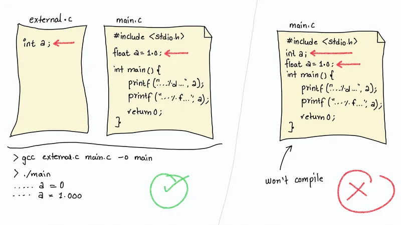

+++
title = 'Redifining Global in C'
date = "2023-05-06"

author = "Piyush Itankar"
authorImage ="teams/piyush.jpg"
preferred = "https://x.com/pyjamabrah"
linkedin = "https://www.linkedin.com/in/streetdogg/"
twitter = "https://x.com/pyjamabrah"
blog = "itankar.com"
email = "piyush@pyjamabrah.com"

tags = [
    "c",
]
categories = [
    "c",
]

series = ["c"]
images = ["/post/redifining-global-in-c/1.webp"]
+++

This post explores how redefinition of a symbol may be possible when using the C language.
<!--more-->



Redefining a global variable is not allowed in C. For the most part this statement is right. Compiling the following will fail because a is redefined as a `float`, after having defined as an `int`.

```c { title="main.c" verbatim=false}
#include <stdio.h>

int a;
float a = 1.0;

int main() {
  printf("int? - a = %d\n", a);
  printf("float? - a = %f\n", a);

  return 0;
}
```

```bash { title="output of the compiler" verbatim=false}
❯ gcc main.c -o main
main.c:4:7: error: redefinition of 'a' with a different type: 'float' vs 'int'
float a = 1.0;
      ^
main.c:3:5: note: previous definition is here
int a;
    ^
main.c:8:32: warning: format specifies type 'double' but the argument has type 'int' [-Wformat]
  printf("float? - a = %f\n", a);
                        ~~    ^
                        %d
1 warning and 1 error generated.
```

The compiler complains about redefinition of `a`. So, `a` cannot be redefined? 😏

## Try this instead!

Move declaration of `a` as an `int` in another `.c` file. And retain the `main.c` as below -

```c { title="external.c" verbatim=false}
int a;
```

```c { title="main.c" verbatim=false}
#include <stdio.h>

float a = 1.0;

int main() {
  printf("int? - a = %d\n", a);
  printf("float? - a = %f\n", a);

  return 0;
}
```
```bash { title="compiling both files" verbatim=false}
❯ gcc external.c main.c -o main
main.c:6:30: warning: format specifies type 'int' but the argument has type 'float' [-Wformat]
  printf("int? - a = %d\n", a);
                      ~~     ^
                      %f
1 warning generated.
```
warning? No error? Yes. It generated the binary. 😱

## And it works! 🤯

```c { title="output on executing the binary" verbatim=false}
❯ ./main
int? - a = 0
float? - a = 1.000000
```


# Weak vs Strong Symbols

The quick answer is - float a is strong definition compared to int a! The linker picks float a as the final definition.

## Details

A weak symbol can have multiple definitions, each associated with a different object file or library. When multiple definitions of a weak symbol are encountered during linking, the linker will select one definition to use, typically based on a priority order. The selected definition becomes the final definition of the symbol, and any references to that symbol will use that definition (as in the image below).

`How the compiler processes the redefinition of symbols.`


> 👉 Assigning a value of `1.0` to a in `float a = 1.0` makes the definition a strong definition! The compiler then enforces that a be treated as a `float` variable!

The concept of weak symbols is particularly useful in cases where you want to provide a default implementation of a function or variable, but allow it to be overridden if needed.

## More

What we saw in this particular case was a very specific example where the notion of weak and strong is implicitly implied based on the declaration of the variable. Compilers usually provide a way for the programmer to explicitly specify a symbol to be weak, in case of GCC, it provides the `__attribute__((weak))` attribute to mark the symbol as weak.

We will discuss more on this in later posts :)
