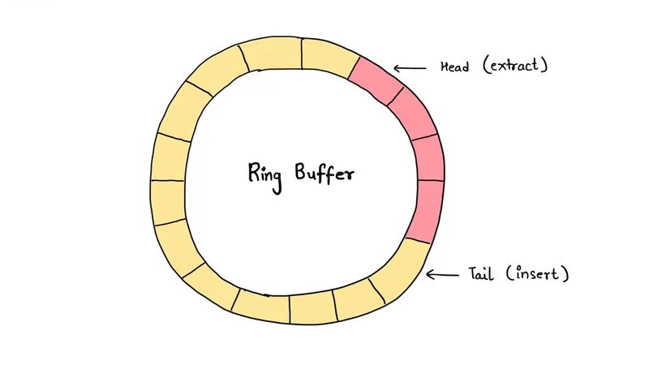

+++
date  = "2023-08-24"
title = 'Dealing with Real-Time Data using Ring Buffers'

author = "Wasim Akram"
authorImage ="/teams/wasim.jpg"
preferred = "https://www.linkedin.com/in/wasim-akram-6a86a09b/"
linkedin = "https://www.linkedin.com/in/wasim-akram-6a86a09b/"
twitter = ""
blog = ""
email = "wasim@inpyjama.com"

tags = [
    "c++ 20", "design pattern"
]

categories = [
    "c++",
]

series = ["C++"]
images = ["/post/ring-buffer/0.webp"]
+++

Embedded systems require efficient data handling, making ring buffers, or circular buffers, a crucial tool.
<!--more-->



Embedded systems often involve managing data streams efficiently, especially when dealing with real-time data acquisition, communication, and processing. One of the key data structures employed for this purpose is the ring buffer, also known as a circular buffer. A ring buffer is particularly useful in scenarios where a fixed-size buffer needs to store data, and new data overwrites the oldest data when the buffer is full. In this article, we'll explore the concept of a ring buffer and its application in embedded systems, accompanied by a practical code example in C++.

## Understanding Ring Buffers

A ring buffer is a data structure that operates as a circular queue, efficiently managing data in a fixed-size buffer. It consists of two pointers, `front` and `rear`, that indicate the current read and write positions, respectively. When data is written to the buffer, the `rear` pointer moves forward, and when data is read from the buffer, the `front` pointer advances. The circular nature of the buffer ensures that the pointers wrap around, creating a continuous loop.

## Benefits of Using Ring Buffers
1. **Efficient Memory Usage**: Ring buffers utilize a fixed amount of memory, making them ideal for resource-constrained embedded systems.
1. **Constant-Time Operations**: Enqueueing and dequeueing elements from the ring buffer takes constant time, regardless of the number of elements in the buffer.
1. **Overwriting Old Data**: When the buffer is full, new data overwrites the oldest data, ensuring that the buffer always contains the most recent information.

## Application in Embedded Systems

Embedded systems frequently encounter scenarios where efficient data handling is crucial. Here are some areas where ring buffers find application:

1. **Sensor Data Acquisition**: In systems that gather data from sensors, a ring buffer can efficiently store the most recent sensor readings. This is vital in real-time applications such as industrial automation and IoT devices.
1. **Communication Interfaces**: When receiving or sending data over communication interfaces like UART, SPI, or I2C, a ring buffer can help manage incoming and outgoing data streams.
1. **Audio and Video Processing**: In audio and video processing applications, where data arrives at a high rate, a ring buffer can ensure a smooth data flow and prevent data loss.

Here's a basic implementation of a ring buffer in C++
```cpp {title="implementation of ring buffer"}
#include <iostream>
#include <vector>
#include <mutex>
#include <thread>
#include <condition_variable>

template <typename T>
class RingBuffer {
public:
    explicit RingBuffer(size_t size) : buffer_(size), size_(size), front_(0), rear_(0) {}

    void push(const T& data) {
        std::unique_lock<std::mutex> lock(mutex_);
        if (isFull()) {
            // If the buffer is full, overwrite the oldest data
            std::cout << "overwrite the oldest data" << std::endl;
            front_ = (front_ + 1) % size_;
        }
        buffer_[rear_] = data;
        rear_ = (rear_ + 1) % size_;
        cv_.notify_one();
    }

    T pop() {
        std::unique_lock<std::mutex> lock(mutex_);
        cv_.wait(lock, [this] { return !isEmpty(); });
        T data = buffer_[front_];
        front_ = (front_ + 1) % size_;
        return data;
    }

private:
    bool isEmpty() const {
        return front_ == rear_;
    }

    bool isFull() const {
        return (rear_ + 1) % size_ == front_;
    }

    std::vector<T> buffer_;
    size_t size_;
    size_t front_;
    size_t rear_;
    std::mutex mutex_;
    std::condition_variable cv_;
};

int main() {
    RingBuffer<int> buffer(20);

    // Producer thread
    std::thread producer([&buffer] {
        for (int i = 1; i <= 100; ++i) {
            buffer.push(i);
            std::cout << "Send: " << i << std::endl;
            //std::this_thread::sleep_for(std::chrono::milliseconds(200));
        }
    });

    // Consumer thread
    std::thread consumer([&buffer] {
        for (int i = 1; i <= 100; ++i) {
            int data = buffer.pop();
            std::cout << "Received: " << data << std::endl;
        }
    });

    producer.join();
    consumer.join();

    return 0;
}
```

Output from above might come scrambled because `std::cout` doesn't grantee thread-safety as per C++ specification. The above code is verified on [online compiler](https://www.onlinegdb.com/online_c++_compiler).

Ring buffers are valuable tools for managing data efficiently in embedded systems. Their ability to handle a fixed-size buffer while accommodating new data and overwriting old data makes them suitable for real-time applications with constrained resources. Whether it's handling sensor data, communication interfaces, or multimedia processing, the ring buffer's constant-time operations and memory efficiency make it an indispensable asset in the embedded world. By understanding the concept of ring buffers and leveraging them effectively, embedded developers can enhance the performance and reliability of their systems.
