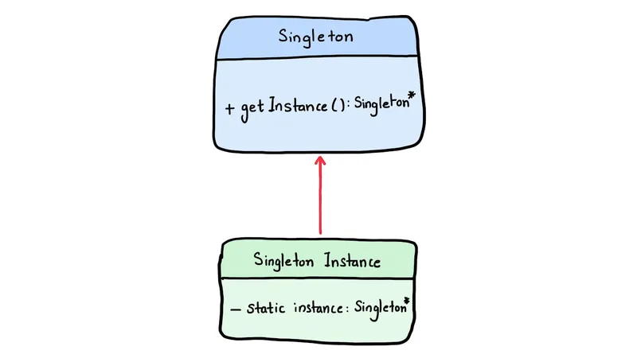

+++
date  = "2023-07-27"
title = 'Singleton Pattern in Embedded Software Development'

author = "Wasim Akram"
authorImage ="/teams/wasim.jpg"
preferred = "https://www.linkedin.com/in/wasim-akram-6a86a09b/"
linkedin = "https://www.linkedin.com/in/wasim-akram-6a86a09b/"
twitter = ""
blog = ""
email = "wasim@inpyjama.com"

tags = [
    "c", "design patterns"
]

categories = [
    "design",
]

series = ["design"]
images = ["/post/singleton-pattern/0.webp"]
+++

The Singleton Pattern is a design pattern that ensures a single instance of a structure and provides a global point of access to that instance. Implementing the Singleton Pattern in Embedded C and Ensuring Universal UART Configuration.
<!--more-->



In embedded systems development, efficiency and resource management are critical. The Singleton Pattern is a design pattern that ensures a single instance of a structure and provides a global point of access to that instance. This pattern is particularly valuable in embedded C programming, where resource utilization and memory management are crucial. In this article, we'll explore how to implement the Singleton Pattern in embedded C to ensure a single instance and provide a real-time code example to demonstrate its practical application.

## Understanding the Singleton Pattern

The Singleton Pattern guarantees that a structure has only one instance throughout the program's lifetime. It achieves this by controlling the access to the instance and ensuring that only one instance is created. Subsequent requests for the instance return the same object, preventing the creation of multiple instances and ensuring global access to it.

## Example
Let's consider an example of an embedded system that communicates with multiple external devices using UART (Universal Asynchronous Receiver/Transmitter). We need a Serial Communication Manager to handle communication with these devices efficiently. The Serial Communication Manager should be a Singleton to avoid multiple instances and ensure a single point of access.

```c {title="Implementing Singleton Pattern for Serial Communication Manager"}
#include <stdio.h>
#include <stdbool.h>

// UART Communication Configurations (example, replace with actual UART configuration)
typedef struct {
    int baud_rate;
    bool parity;
    // Add other configurations...
} UartConfig;

// Singleton Serial Communication Manager Structure
typedef struct {
    UartConfig uart_config;
    // Add other members and methods as needed...
} SerialCommunicationManager;

// Global static instance of Serial Communication Manager
static SerialCommunicationManager communication_manager_instance = { { 9600, false } }; // Initialized to default values

// Singleton function to get the Serial Communication Manager instance
SerialCommunicationManager* getSerialCommunicationManagerInstance() {
    // Perform initialization only once
    if (communication_manager_instance.uart_config.baud_rate == 0) {
        // Initialize UART configuration
        communication_manager_instance.uart_config.baud_rate = 9600;
        communication_manager_instance.uart_config.parity = false;
        // Initialize other UART configurations...

        // Additional initialization code can be placed here.
    }
    return &communication_manager_instance;
}

// Function to send data via UART
void sendDataViaUart(const char* data) {
    // Get Serial Communication Manager instance
    SerialCommunicationManager* communication_manager = getSerialCommunicationManagerInstance();

    // UART send implementation using the configuration
    printf("Sending data via UART: %s\n", data);
    printf("UART Baud Rate: %d\n", communication_manager->uart_config.baud_rate);
    printf("UART Parity: %s\n", communication_manager->uart_config.parity ? "Enabled" : "Disabled");
    // UART implementation details...

    // Additional UART send code...
}

int main() {
    // Get the Serial Communication Manager instance
    SerialCommunicationManager* comm_manager = getSerialCommunicationManagerInstance();

    // Use the Serial Communication Manager to send data via UART
    sendDataViaUart("Hello, world!");

    // Change the Baud Rate universally
    comm_manager->uart_config.baud_rate = 115200;

    // Use the updated Serial Communication Manager to send data via UART
    sendDataViaUart("Hello again!");

    return 0;
}
```

```bash {title="output"}
Sending data via UART: Hello, world!
UART Baud Rate: 9600
UART Parity: Disabled
Sending data via UART: Hello again!
UART Baud Rate: 115200
UART Parity: Disabled
```

## Explanation

In the example, we define a `UartConfig` structure to hold UART communication configurations (e.g., baud rate, parity, etc.).

We then create a `SerialCommunicationManager` structure, which represents our Singleton instance to handle UART communication configurations. It contains a `UartConfig` member to store UART configurations. In a real-world scenario, this structure would include more members and methods related to UART communication.

We create a global static instance communication_manager_instance of type `SerialCommunicationManager` to hold the single instance of the `SerialCommunicationManager`. It is statically initialized to default values (baud rate: 9600, parity: disabled) thanks to the inner struct initialization.

The `getSerialCommunicationManagerInstance()` function serves as the Singleton method. It is responsible for returning the single instance of the `SerialCommunicationManager`. The function ensures that initialization is done only once by checking if the communication_manager_instance has been initialized (e.g., checking if the baud rate is non-zero). If it is not initialized, the function sets the default UART configurations. Subsequent calls to `getSerialCommunicationManagerInstance()` will always return the same instance.

In the `main()` function, we demonstrate how to use the Singleton instance of the `SerialCommunicationManager` to send data via UART. We call the `sendDataViaUart()` function to send the data `"Hello, world!"` using the UART configurations obtained from the Singleton instance. Then we change the baud rate universally to 115200 and use the updated Serial Communication Manager to send data again with the new baud rate.

## Advantages of Singleton Pattern in Embedded C

1. **Resource Efficiency**: The Singleton Pattern ensures that only one instance of the structure exists, preventing wasteful memory allocation and resource consumption in embedded systems.
1. **Global Access**: The Singleton instance can be accessed from anywhere in the program, providing a centralized point to manage global data.
1. **Consistency**: By having a single instance, the Singleton Pattern promotes consistency across the system, as all components access the same Serial Communication Manager with the same UART settings.
1. **Initialization Control**: The Singleton method allows us to control the initialization of the instance, ensuring that it is properly initialized before use.

## Conclusion

The Singleton Pattern is a valuable design pattern in embedded C programming, ensuring the existence of a single instance of a structure with global access. In this article, we explored how to implement the Singleton Pattern for a Serial Communication Manager in an embedded system.
